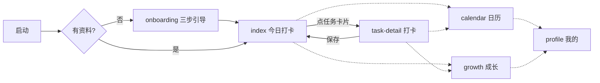

# 设计规范与信息架构

## 1. 信息架构

```
启动
└─ index（今日打卡）【Tab 1 ☀️】
   ├─ 未初始化 → reLaunch → onboarding（三步引导，完成后 switchTab 回首页）
   └─ 任务卡片 → task-detail（打卡/更新/取消，保存后返回并刷新）
├─ calendar（打卡日历）【Tab 2 📅】 —— 月历热力图 + 单日明细
├─ growth（成长）【Tab 3 🌱】 —— 称号/连击/周分布/勋章墙
└─ profile（我的）【Tab 4 🙂】 —— 资料/导出/清空
```

页面流转（mermaid）：



## 2. 视觉规范

**风格**：暖奶油底色 + 活力橙主色，大圆角、大字号、emoji 图标体系 —— 低龄友好、零图片资源、包体极小。

### 色板

| 用途 | 色值 |
| --- | --- |
| 页面底色 | `#FFF6E9` |
| 主色（按钮/进度/选中） | `#FF8A00`，浅档 `#FFF1DC` / `#FFB25A` |
| 卡片 | `#FFFFFF`，圆角 24-28rpx，投影 `rgba(255,143,31,.07)` |
| 正文 / 次要文字 | `#33302B` / `#9A948B` |

### 板块色（学科辨识，全站一致）

| 板块 | 主色 | 浅底 |
| --- | --- | --- |
| 语文 | `#FF6B6B` | `#FFEBEB` |
| 数学 | `#4D96FF` | `#E8F1FF` |
| 英语 | `#9B5DE5` | `#F3EAFE` |
| 运动 | `#37B24D` | `#E8F8EC` |
| 娱乐 | `#F59F00` | `#FFF4D6` |
| 习惯 | `#12B5B0` | `#E0F7F6` |

### 字号 / 间距

- 页面标题 40rpx、卡片标题 32rpx、正文 28rpx、辅助 24rpx、角标 20-22rpx
- 卡片内边距 24-32rpx，页面左右留白 24rpx，卡片间距 24rpx
- 触控目标 ≥ 84rpx（儿童手指操作）

## 3. 关键组件

| 组件 | 位置 | 说明 |
| --- | --- | --- |
| 进度环 | 首页 | CSS `conic-gradient` 实现，中心显示 `done/total`，无 canvas 依赖 |
| 任务卡片 | 首页 | emoji 方块 + 名称 + 必做角标 + 目标行 + 右侧状态（未完成空心圆 / 完成⭐n） |
| 步进器 + 快捷档 | task-detail | ±5/±10 步进；快捷档取目标值的 1/2/3 倍 |
| 星级自评 | task-detail | 😅加油(1⭐) 😊不错(2⭐) 🤩超棒(3⭐) |
| 月历格 | calendar | 绿底圆=达成、黄底圆=有打卡、空心=未打卡、描边=今天/选中 |
| 勋章格 | growth | 未获得灰度+❓制造收集欲，已获得亮起+日期 |
| 跟读卡片 | read-aloud | 三态：空闲(🎙️录音)→录音中(⏹停止+计时脉冲)→已录(▶️播放/🔁重录/时长)；录音仅存本机 |
| 自定义 tabBar | 全局 | emoji 图标，无图片资源依赖 |

## 4. 关键交互

1. **打卡流**：点卡片 → 详情页 → 填数值/星级 → 保存 → 轻震动 + toast（新勋章优先播报）→ 返回自动刷新。已打卡可进入更新或取消。
2. **家长确认**：屏幕时间类任务首次保存弹 `wx.showModal` 确认，完成后不再重复确认（更新时）。
3. **连击保护**：今天还没打卡时，连击数按"到昨天为止"计算并展示，避免清晨打开就看到断签挫败感。
4. **防误触/防焦虑**：取消打卡需二次确认；清空数据需两次确认且提示先导出备份。

## 5. 可用性考量（面向 6-11 岁用户）

- 所有任务用 emoji + 颜色双编码，一年级孩子也能"看图识字"找到自己的任务
- 必做/自选分级，避免清单过长造成畏难；首页只呈现"今天"
- 文案全部口语化（"太棒啦！""快去开始吧！"），不使用说教语气
- 星星即时反馈 + 每日目标只有一条简单规则（完成必做）
